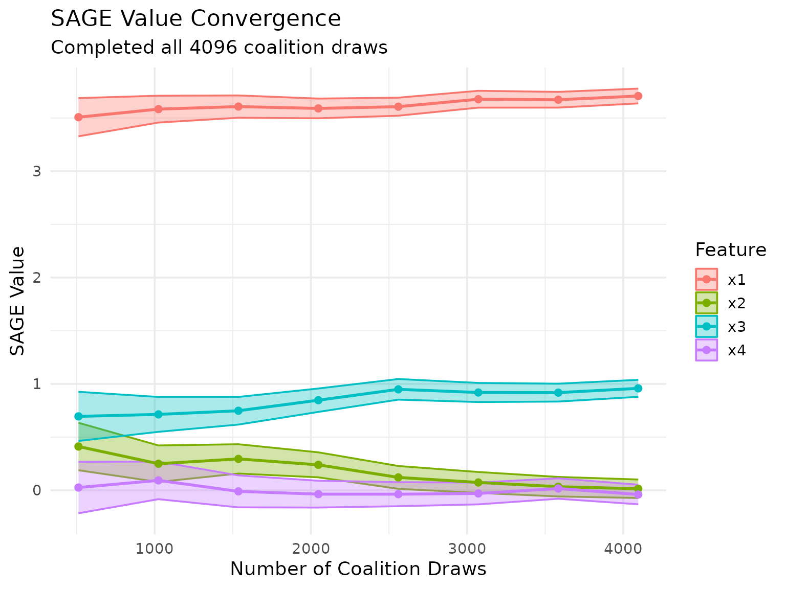
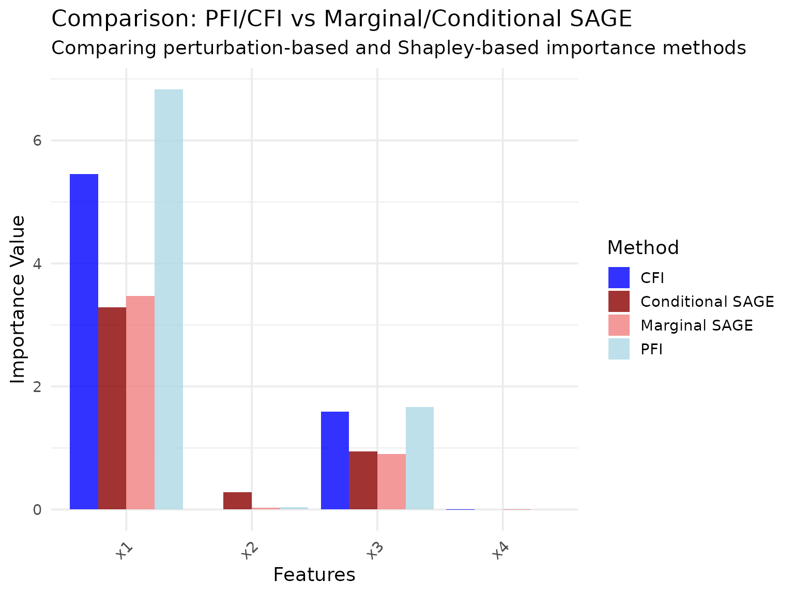

# Shapley Additive Global Importance (SAGE)

``` r

library(xplainfi)
library(mlr3)
library(mlr3learners)
library(ggplot2)
```

## Introduction

Shapley Additive Global Importance (SAGE) is a feature importance method
based on cooperative game theory. It uses Shapley values to distribute
the model’s total prediction performance among features. Unlike
perturbation-based methods (PFI/CFI) that measure performance
degradation when features are perturbed, SAGE measures each feature’s
contribution through marginalization.

A key property of SAGE is that it provides a complete decomposition: the
sum of all SAGE values equals the difference between the model’s
performance and the performance when all features are marginalized.

`xplainfi` provides two implementations:

- **MarginalSAGE**: Marginalizes features independently (standard SAGE
  implementation)
- **ConditionalSAGE**: Marginalizes features using conditional sampling

**Note on interpretation**: SAGE’s theoretical properties and
interpretation differ from perturbation-based methods. While PFI/CFI
have clearer interpretations in terms of predictive performance, SAGE’s
results can be more challenging to interpret, particularly when using
conditional sampling. The choice of conditional sampler can
significantly affect results, and there is limited empirical guidance on
best practices. This vignette focuses on demonstrating the methods
rather than making strong interpretive claims.

**The SAGE estimator** implemented here is what is referred to as the
“permutation estimator” in other implementations. It works by first
building up `n_permutations` permutations of the feature vector and then
successively evaluating prefixes of the sequence from left to right as
coalitions to evaluated. If a task has features `(x1, x2, x3)`, one
permutation could be `(x2, x1, x3)`, resulting in these coalitions to be
evaluated: `(x2)`, `(x2, x1)`, and `(x2, x1, x3)`. The empty coalition
will always be evaluated, resulting in a total number of evaluations of
`n_permutations * n_features + 1`.

## Demonstration with Correlated Features

To showcase the difference between Marginal and Conditional SAGE, we’ll
use the
[`sim_dgp_correlated()`](https://mlr-org.github.io/xplainfi/reference/sim_dgp_scenarios.md)
function which creates a simple linear DGP with two correlated features.

**Model:** \\(X_1, X_2)^T \sim \text{MVN}(0, \Sigma)\\

where \\\Sigma\\ is a 2×2 covariance matrix with 1 on the diagonal and
correlation \\r\\ (default 0.5) on the off-diagonal.

\\X_3 \sim N(0,1), \quad X_4 \sim N(0,1)\\ \\Y = 2 \cdot X_1 + X_3 +
\varepsilon\\

where \\\varepsilon \sim N(0, 0.2^2)\\.

**Data generating process:**

- `x1` has a direct effect on y (β=2.0)
- `x2` is correlated with x1 (r = 0.5) but has no direct effect on y
- `x3` is independent with a direct effect (β=1.0)
- `x4` is independent noise (β=0)

``` r

set.seed(123)
task = sim_dgp_correlated(n = 1000, r = 0.5)

# Check the correlation structure
task_data = task$data()
correlation_matrix = cor(task_data[, c("x1", "x2", "x3", "x4")])
round(correlation_matrix, 3)
#>        x1     x2     x3     x4
#> x1  1.000  0.447 -0.005 -0.048
#> x2  0.447  1.000 -0.049 -0.054
#> x3 -0.005 -0.049  1.000  0.051
#> x4 -0.048 -0.054  0.051  1.000
```

This DGP allows us to observe how the two SAGE variants handle
correlated features with different roles in the data generating process.

Let’s set up our learner and measure. We’ll use a random forest and
instantiate a resampling to ensure both methods see the same data:

``` r

learner = lrn("regr.ranger")
measure = msr("regr.mse")
resampling = rsmp("holdout")
resampling$instantiate(task)
```

## Marginal SAGE

Marginal SAGE marginalizes features independently by averaging
predictions over a subset of `n_samples` observations drawn from the
test dataset. We use 15 permutations of the feature vector to build
coalitions, resulting in 61 evaluated coalitions (`15 * 4 + 1`).

``` r

# Create Marginal SAGE instance
marginal_sage = MarginalSAGE$new(
    task = task,
    learner = learner,
    measure = measure,
    resampling = resampling,
    n_permutations = 15L,
    n_samples = 100L
)

# Compute SAGE values
marginal_sage$compute(batch_size = 5000L)
#> ℹ The permutation estimator will evaluate 61 coalitions, at least as many as
#>   enumerating all 16 (2^4) coalitions.
#> ℹ `estimator = "exact"` computes SAGE values without coalition-sampling error
#>   at the same or lower cost (for <ConditionalSAGE>, oversampling can still be
#>   deliberate; see the `estimator` docs).
```

Let’s visualize the results:


We can also keep track of the SAGE value approximation across
permutations:

``` r

marginal_sage$plot_convergence()
#> Warning: Removed 4 rows containing missing values or values outside the scale range
#> (`geom_ribbon()`).
```


### Early Stopping Based on Convergence

SAGE supports early stopping to save computation time when the
importance values have converged. It is off by default; enable it with
`early_stopping = TRUE`. Convergence is detected by monitoring the
standard error (SE) of the SAGE value estimates in the first resampling
iteration.

SAGE normalizes the SE by the range of their values (max - min) to make
convergence detection scale-invariant across different loss metrics.
Convergence is detected when:

\\ \max_j \left(\frac{SE_j}{\max_i(\text{SAGE}\_i) -
\min_i(\text{SAGE}\_i)}\right) \< \text{threshold} \\

The default threshold is `se_threshold = 0.025` (2.5%), meaning
convergence occurs when the relative SE is below 2.5% of the importance
range for all features, which is the criterion and default of the Python
`sage` package.

With early stopping, `n_permutations` is an upper bound rather than a
planned cost: if the criterion is not met within it, the values are
returned with a warning.

You can customize convergence detection in `$compute()`:

``` r

# More strict convergence (requires more permutations)
sage$compute(early_stopping = TRUE, se_threshold = 0.005, min_permutations = 5L)

# Disable early stopping to always run all permutations
sage$compute(early_stopping = FALSE)
```

After computation, `$budget` reports the requested and actually used
effort, the implied number of evaluated coalitions, and whether the
criterion was met:

``` r

marginal_sage$budget
```

If a resampling with multiple iterations (i.e., not holdout) is
supplied, the budget used by the first iteration is reused for all
subsequent iterations to avoid some computational overhead.

### Kernel SAGE

`estimator = "kernel"` is the regression-based estimator of Covert & Lee
(2021), the `KernelEstimator` of the Python `sage` package: Shapley
values are the solution of a weighted least squares problem with the
Shapley kernel as weights, approximated from sampled coalitions. Unlike
the permutation estimator, which evaluates every coalition on the whole
test set, each coalition draw here is evaluated on a single, randomly
drawn test observation and enters via the measure’s observation-wise
loss. A coalition evaluation therefore costs `n_samples` model rows
instead of `n_test * n_samples`, and the budget `n_coalitions` (paired
draws, each evaluating a coalition and its complement) is
correspondingly large. This requires a measure with an observation-wise
loss (`"obs_loss"` in `measure$properties`, e.g. `regr.mse` or
`classif.logloss`, but not `classif.auc`), and it is currently available
for `MarginalSAGE` only.

``` r

kernel_sage = MarginalSAGE$new(
    task = task,
    learner = learner,
    measure = measure,
    resampling = resampling,
    estimator = "kernel",
    n_coalitions = 4096L,
    n_samples = 50L
)
kernel_sage$compute()
kernel_sage$importance()
#> Key: <feature>
#>    feature  importance
#>     <char>       <num>
#> 1:      x1  3.70660937
#> 2:      x2  0.01462180
#> 3:      x3  0.95851217
#> 4:      x4 -0.03940827
kernel_sage$budget
#>    estimator            unit requested  used n_evals n_rows converged
#>       <char>          <char>     <num> <num>   <num>  <num>    <lgcl>
#> 1:    kernel coalition draws      4096  4096    8194 442900     FALSE
kernel_sage$plot_convergence()
```



For such measures the kernel estimator targets the same SAGE values as
the permutation estimator, so the two can be compared on
`$budget$n_rows`, the number of model rows predicted.

### Convergence is not inference

Both sampling estimators report a standard error per feature in
`$convergence_history`, summarized for the final estimate by
`$convergence()`:

``` r

kernel_sage$convergence()
#>    feature  importance         se      ratio
#>     <char>       <num>      <num>      <num>
#> 1:      x1  3.70660937 0.06954240 0.02456035
#> 2:      x2  0.01462180 0.08695250 0.02456035
#> 3:      x3  0.95851217 0.07996639 0.02456035
#> 4:      x4 -0.03940827 0.09200349 0.02456035
```

These are Monte Carlo standard errors of the *estimator* for the fixed
trained model, test set, and reference subsample: they say how much the
values would still move with more sampling, which is what
`early_stopping` compares against `se_threshold` (Covert & Lee, 2021,
Section 4.3). They do not quantify uncertainty about feature importance,
since a fixed model’s SAGE values are fixed numbers, and any nonzero
value ends up several standard errors from zero once enough coalitions
are sampled. Inference about feature importance, e.g. across train/test
splits, is the job of the `ci_method`s of `$importance()`; see the
inference article.

### Exact SAGE for verification

When the number of features is small, you can sidestep coalition
sampling entirely and compute the SAGE values *exactly* with
`estimator = "exact"`, which enumerates all `2^p` coalitions:

``` r

task_small = sim_dgp_correlated(n = 500) # four features
resampling_s = rsmp("holdout")
resampling_s$instantiate(task_small)

sage_exact = MarginalSAGE$new(
    task = task_small,
    learner = lrn("regr.ranger", num.trees = 50),
    measure = msr("regr.mse"),
    resampling = resampling_s,
    estimator = "exact",
    n_samples = 50L
)
sage_exact$compute()
sage_exact$importance()
#> Key: <feature>
#>    feature   importance
#>     <char>        <num>
#> 1:      x1  2.636791061
#> 2:      x2  0.863743216
#> 3:      x3  0.997765064
#> 4:      x4 -0.002473804
sage_exact$budget
#>    estimator       unit requested  used n_evals n_rows converged
#>       <char>     <char>     <num> <num>   <num>  <num>    <lgcl>
#> 1:     exact coalitions        16    16      16 133600        NA
```

This is guarded by `max_features` (default 12), since the number of
coalitions grows as `2^p`. It carries no coalition-sampling error, so
for `MarginalSAGE` it yields the exact Shapley values of the value
function that the permutation estimator approximates, which makes it a
convenient ground-truth reference when validating or comparing
estimators. The costs are directly comparable via the number of
evaluated coalitions (`$budget$n_evals`): `1 + n_permutations * p` for
the permutation estimator and `2^p` for exact enumeration. When a
permutation budget meets or exceeds the exact cost, `$compute()` points
this out in a message (silenced by `xplain_opt(verbose = FALSE)`). Note
that “exact” refers to coalition sampling only: the *marginalization
error* controlled by `n_samples` remains, and for `ConditionalSAGE` the
value function is itself estimated by a sampler, so “exact” removes the
coalition-sampling error but not the sampler’s Monte Carlo error.

## Conditional SAGE

Conditional SAGE uses conditional sampling (via ARF by default) to
marginalize features while preserving dependencies between the remaining
features. This can provide different insights, especially when features
are correlated.

``` r

# Create Conditional SAGE instance using a conditional sampler
sampler_gaussian = ConditionalGaussianSampler$new(task)

conditional_sage = ConditionalSAGE$new(
    task = task,
    learner = learner,
    measure = measure,
    resampling = resampling,
    n_permutations = 15L,
    n_samples = 100L,
    sampler = sampler_gaussian
)

# Compute SAGE values
conditional_sage$compute(batch_size = 5000L)
#> ℹ The permutation estimator will evaluate 61 coalitions, at least as many as
#>   enumerating all 16 (2^4) coalitions.
#> ℹ `estimator = "exact"` computes SAGE values without coalition-sampling error
#>   at the same or lower cost (for <ConditionalSAGE>, oversampling can still be
#>   deliberate; see the `estimator` docs).
```

Let’s visualize the conditional SAGE results:


``` r

conditional_sage$plot_convergence()
#> Warning: Removed 4 rows containing missing values or values outside the scale range
#> (`geom_ribbon()`).
```


## Comparison of Methods

Let’s compare the two SAGE methods side by side:


### Methodological Notes

The difference between the two methods:

- **MarginalSAGE**: Marginalizes all out-of-coalition features
  simultaneously by sampling from the marginal distribution, but does
  not account for conditional dependencies between in-coalition and
  out-of-coalition features.

- **ConditionalSAGE**: Uses conditional sampling to “marginalize”
  out-of-coalition features while preserving the conditional dependency
  structure between in-coalition and out-of-coalition features.

The interpretation of SAGE values, particularly for ConditionalSAGE, can
be affected by the specific conditional sampler used and the nature of
feature dependencies in the data. The choice of sampler can
significantly affect results, and there is currently limited empirical
guidance on best practices for different settings.

## Comparison with PFI and CFI

For reference, let’s compare SAGE methods with the analogous PFI and CFI
methods on the same data:

``` r

# Quick PFI and CFI comparison for context
pfi = PFI$new(task, learner, measure)
#> ℹ No <Resampling> provided, using `resampling = rsmp("holdout", ratio = 2/3)`
#>   (test set size: 333)
cfi = CFI$new(task, learner, measure, sampler = sampler_gaussian)
#> ℹ No <Resampling> provided, using `resampling = rsmp("holdout", ratio = 2/3)`
#>   (test set size: 333)

pfi$compute()
cfi$compute()
pfi_results = pfi$importance()
cfi_results = cfi$importance()

# Create comparison data frame
method_comparison = data.frame(
    feature = rep(c("x1", "x2", "x3", "x4"), 4),
    importance = c(
        pfi_results$importance,
        cfi_results$importance,
        marginal_results$importance,
        conditional_results$importance
    ),
    method = rep(c("PFI", "CFI", "Marginal SAGE", "Conditional SAGE"), each = 4),
    approach = rep(c("Marginal", "Conditional", "Marginal", "Conditional"), each = 4)
)

# Create comparison plot
#| fig.alt: "Grouped bar chart with features on x-axis and importance on y-axis. Four colored bars per feature for PFI, CFI, Marginal SAGE, and Conditional SAGE."
ggplot(method_comparison, aes(x = feature, y = importance, fill = method)) +
    geom_col(position = "dodge", alpha = 0.8) +
    scale_fill_manual(
        values = c(
            "PFI" = "lightblue",
            "CFI" = "blue",
            "Marginal SAGE" = "lightcoral",
            "Conditional SAGE" = "darkred"
        )
    ) +
    labs(
        title = "Comparison: PFI/CFI vs Marginal/Conditional SAGE",
        subtitle = "Comparing perturbation-based and Shapley-based importance methods",
        x = "Features",
        y = "Importance Value",
        fill = "Method"
    ) +
    theme_minimal(base_size = 14) +
    theme(axis.text.x = element_text(angle = 45, hjust = 1))
```



While both PFI/CFI and MarginalSAGE/ConditionalSAGE distinguish between
marginal and conditional approaches, these method families measure
fundamentally different quantities. PFI and CFI measure the drop in
predictive performance when features are perturbed, making their
interpretation in terms of prediction loss relatively straightforward.
SAGE methods measure each feature’s contribution to overall performance
through Shapley value decomposition, which involves a different
theoretical framework. The results shown here demonstrate the methods on
the same data, but direct comparisons of the numerical values should be
made with these methodological differences in mind.
