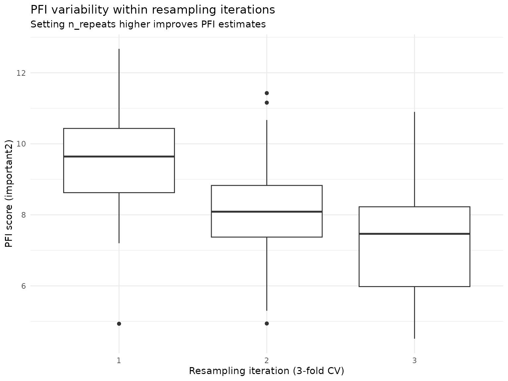

# Getting Started with xplainfi

``` r
library(xplainfi)
library(mlr3)
library(mlr3learners)
library(data.table)
library(ggplot2)
```

`xplainfi` provides feature importance methods for machine learning
models. It implements several approaches for measuring how much each
feature contributes to model performance, with a focus on model-agnostic
methods that work with any learner.

## Core Concepts

Feature importance methods in `xplainfi` address different but related
questions:

- **How much does each feature contribute to model performance?**
  (Permutation Feature Importance)
- **What happens when we remove features and retrain?**
  (Leave-One-Covariate-Out)  
- **How do features depend on each other?** (Conditional and Relative
  methods)

All methods share a common interface built on
[mlr3](https://mlr3.mlr-org.com/), making them easy to use with any
task, learner, measure, and resampling strategy.

The general pattern is to call `$compute()` to calculate importance
(which *always re-computes*), then `$importance()` to retrieve the
aggregated results, with intermediate results available in `$scores()`
and, if the chosen measure supports it, `$obs_loss()`.

## Basic Example

Let’s use the Friedman1 task to demonstrate feature importance methods
with known ground truth:

``` r
task <- tgen("friedman1")$generate(n = 300)
learner <- lrn("regr.ranger", num.trees = 100)
measure <- msr("regr.mse")
resampling <- rsmp("cv", folds = 3)
```

The task has 300 observations with 10 features. Features `important1`
through `important5` truly affect the target, while `unimportant1`
through `unimportant5` are pure noise. We’ll use a random forest learner
with cross-validation for more stable estimates.

The target function is: \\y = 10 \cdot \operatorname{sin}(\pi x_1 x_2) +
20 (x_3 - 0.5)^2 + 10 x_4 + 5 x_5 + \epsilon\\

## Permutation Feature Importance (PFI)

PFI is the most straightforward method: for each feature, we permute
(shuffle) its values and measure how much model performance
deteriorates. More important features cause larger performance drops
when shuffled.

``` r
pfi <- PFI$new(
    task = task,
    learner = learner,
    measure = measure,
    resampling = resampling,
    n_repeats = 10
)

pfi$compute()
pfi$importance()
#> Key: <feature>
#>          feature   importance
#>           <char>        <num>
#>  1:   important1  5.545674370
#>  2:   important2  8.968101641
#>  3:   important3  1.261353831
#>  4:   important4 12.673269112
#>  5:   important5  2.005969867
#>  6: unimportant1  0.004208592
#>  7: unimportant2  0.093948304
#>  8: unimportant3  0.080041842
#>  9: unimportant4 -0.029783843
#> 10: unimportant5 -0.088944796
```

The `importance` column shows the performance difference when each
feature is permuted. Higher values indicate more important features.

For more stable estimates, we can use multiple permutation iterations
per resampling fold with `n_repeats`, which is set to `30` by default
for all methods. Note that in this case “more is more”, and while there
is no clear “good enough” value, setting `n_repeats` to a small value
like 1 will most definitely yield unreliable results.

``` r
pfi_stable <- PFI$new(
    task = task,
    learner = learner,
    measure = measure,
    resampling = resampling,
    n_repeats = 50
)

pfi_stable$compute()
pfi_stable$importance()
#> Key: <feature>
#>          feature  importance
#>           <char>       <num>
#>  1:   important1  5.47062536
#>  2:   important2  8.31221894
#>  3:   important3  1.19280876
#>  4:   important4 12.24462886
#>  5:   important5  2.01412225
#>  6: unimportant1 -0.02250072
#>  7: unimportant2  0.12486533
#>  8: unimportant3  0.04175966
#>  9: unimportant4  0.05038402
#> 10: unimportant5 -0.09342671
```

To illustrate why this is important, we can take a look at the
variability of PFI scores for feature `important2` within each
resampling iteration using individual importance scores via `$score()`
(see below):

``` r
pfi_stable$scores()[feature == "important2", ] |>
    ggplot(aes(y = importance, x = factor(iter_rsmp))) +
    geom_boxplot() +
    labs(
        title = "PFI variability within resampling iterations",
        subtitle = "Setting n_repeats higher improves PFI estimates",
        y = "PFI score (important2)",
        x = "Resampling iteration (3-fold CV)"
    ) +
    theme_minimal()
```



The aggregated importance score for this feature is approximately 8.3,
but across all resamplings the estimated PFI scores range from 4.51 to
12.67, and with insufficient resampling or low `n_repeats`, we might
have over- or underestimated the features PFI by some margin.

We can also use the ratio of performance scores instead of their
difference for the importance calculation, meaning that an unimportant
feature is now expected to get an importance score of 1 rather than 0:

``` r
pfi_stable$importance(relation = "ratio")
#> Key: <feature>
#>          feature importance
#>           <char>      <num>
#>  1:   important1  1.8678890
#>  2:   important2  2.3092581
#>  3:   important3  1.1900256
#>  4:   important4  2.9573191
#>  5:   important5  1.3219625
#>  6: unimportant1  0.9969603
#>  7: unimportant2  1.0166104
#>  8: unimportant3  1.0070529
#>  9: unimportant4  1.0074279
#> 10: unimportant5  0.9873048
```

## Leave-One-Covariate-Out (LOCO)

LOCO measures importance by retraining the model without each feature
and comparing performance to the full model. This shows the contribution
of each feature when all other features are present.

``` r
loco <- LOCO$new(
    task = task,
    learner = learner,
    measure = measure,
    resampling = resampling,
    n_repeats = 10
)

loco$compute()
loco$importance()
#> Key: <feature>
#>          feature  importance
#>           <char>       <num>
#>  1:   important1  3.62257756
#>  2:   important2  5.60038686
#>  3:   important3  0.96616913
#>  4:   important4  7.77084397
#>  5:   important5  0.91573094
#>  6: unimportant1 -0.21657782
#>  7: unimportant2 -0.10069618
#>  8: unimportant3 -0.07475981
#>  9: unimportant4 -0.13525518
#> 10: unimportant5 -0.23400214
```

LOCO is computationally expensive as it requires retraining for each
feature, but provides clear interpretation: higher values mean larger
performance drop when the feature is removed. However, it cannot
distinguish between direct effects and indirect effects through
correlated features.

## Feature Samplers

For advanced methods that account for feature dependencies, `xplainfi`
provides different sampling strategies. While PFI uses simple
permutation (marginal sampling), conditional samplers can preserve
feature relationships.

Let’s demonstrate conditional sampling using adversarial random forests
(ARF), which preserves relationships between features when sampling:

``` r
arf_sampler <- ConditionalARFSampler$new(task)

sample_data <- task$data(rows = 1:5)
sample_data[, .(important1, important2)]
#>    important1  important2
#>         <num>       <num>
#> 1:  0.2875775 0.784575267
#> 2:  0.7883051 0.009429905
#> 3:  0.4089769 0.779065883
#> 4:  0.8830174 0.729390652
#> 5:  0.9404673 0.630131853
```

Now we’ll conditionally sample the `important1` feature given the values
of `important2` and `important3`:

``` r
sampled_conditional <- arf_sampler$sample_newdata(
    feature = "important1",
    newdata = sample_data,
    conditioning_set = c("important2", "important3")
)

sample_data[, .(important1, important2, important3)]
#>    important1  important2 important3
#>         <num>       <num>      <num>
#> 1:  0.2875775 0.784575267  0.2372297
#> 2:  0.7883051 0.009429905  0.6864904
#> 3:  0.4089769 0.779065883  0.2258184
#> 4:  0.8830174 0.729390652  0.3184946
#> 5:  0.9404673 0.630131853  0.1739838
sampled_conditional[, .(important1, important2, important3)]
#>    important1  important2 important3
#>         <num>       <num>      <num>
#> 1:  0.7928991 0.784575267  0.2372297
#> 2:  0.6233185 0.009429905  0.6864904
#> 3:  0.1203356 0.779065883  0.2258184
#> 4:  0.8458796 0.729390652  0.3184946
#> 5:  0.8990316 0.630131853  0.1739838
```

This conditional sampling is essential for methods like CFI and RFI that
need to preserve feature dependencies. See the [perturbation-importance
article](https://mlr-org.github.io/xplainfi/articles/perturbation-importance.html)
for detailed comparisons and
[`vignette("feature-samplers")`](https://mlr-org.github.io/xplainfi/articles/feature-samplers.md)
for more details on implemented samplers.

## Detailed Scoring Information

All methods store detailed scoring information from each resampling
iteration for further analysis. Let’s examine the structure of PFI’s
detailed scores:

``` r
pfi$scores() |>
    head(10) |>
    knitr::kable(digits = 4, caption = "Detailed PFI scores (first 10 rows)")
```

| feature    | iter_rsmp | iter_repeat | regr.mse_baseline | regr.mse_post | importance |
|:-----------|----------:|------------:|------------------:|--------------:|-----------:|
| important1 |         1 |           1 |            4.3358 |       10.6616 |     6.3258 |
| important1 |         1 |           2 |            4.3358 |        9.4661 |     5.1303 |
| important1 |         1 |           3 |            4.3358 |        7.7194 |     3.3837 |
| important1 |         1 |           4 |            4.3358 |        8.9057 |     4.5699 |
| important1 |         1 |           5 |            4.3358 |        9.4691 |     5.1333 |
| important1 |         1 |           6 |            4.3358 |        9.0111 |     4.6753 |
| important1 |         1 |           7 |            4.3358 |        9.3553 |     5.0195 |
| important1 |         1 |           8 |            4.3358 |       10.0281 |     5.6923 |
| important1 |         1 |           9 |            4.3358 |        9.7933 |     5.4575 |
| important1 |         1 |          10 |            4.3358 |        9.1412 |     4.8055 |

Detailed PFI scores (first 10 rows)

We can also summarize the scoring structure:

``` r
pfi$scores()[, .(
    features = uniqueN(feature),
    resampling_folds = uniqueN(iter_rsmp),
    permutation_iters = uniqueN(iter_repeat),
    total_scores = .N
)]
#>    features resampling_folds permutation_iters total_scores
#>       <int>            <int>             <int>        <int>
#> 1:       10                3                10          300
```

So `$importance()` always gives us the aggregated importances across
multiple resampling- and permutation-/refitting iterations, whereas
`$scores()` gives you the individual scores as calculated by the
supplied `measure` and the corresponding importance calculated from the
difference of these scores by default.

Analogous to `$importance()`, you can also use `relation = "ratio"`
here:

``` r
pfi$scores(relation = "ratio") |>
    head(10) |>
    knitr::kable(digits = 4, caption = "PFI scores using the ratio (first 10 rows)")
```

| feature    | iter_rsmp | iter_repeat | regr.mse_baseline | regr.mse_post | importance |
|:-----------|----------:|------------:|------------------:|--------------:|-----------:|
| important1 |         1 |           1 |            4.3358 |       10.6616 |     2.4590 |
| important1 |         1 |           2 |            4.3358 |        9.4661 |     2.1833 |
| important1 |         1 |           3 |            4.3358 |        7.7194 |     1.7804 |
| important1 |         1 |           4 |            4.3358 |        8.9057 |     2.0540 |
| important1 |         1 |           5 |            4.3358 |        9.4691 |     2.1840 |
| important1 |         1 |           6 |            4.3358 |        9.0111 |     2.0783 |
| important1 |         1 |           7 |            4.3358 |        9.3553 |     2.1577 |
| important1 |         1 |           8 |            4.3358 |       10.0281 |     2.3129 |
| important1 |         1 |           9 |            4.3358 |        9.7933 |     2.2587 |
| important1 |         1 |          10 |            4.3358 |        9.1412 |     2.1083 |

PFI scores using the ratio (first 10 rows)

## Observation-wise losses and importances

For methods where importances are calculated based on observation-level
comparisons and with decomposable measures, we can also retrieve
observation-level information with `$obs_loss()`, which works
analogously to `$scores()` and `$importance()` but at an even more
detailed level:

``` r
pfi$obs_loss()
#>             feature iter_rsmp iter_repeat row_ids loss_baseline  loss_post
#>              <char>     <int>       <int>   <int>         <num>      <num>
#>     1:   important1         1           1       1     3.3403244  2.5440536
#>     2:   important1         1           1       9     0.4640003  5.2814472
#>     3:   important1         1           1      11     1.0938319  0.4286004
#>     4:   important1         1           1      12     2.0091331  2.3334294
#>     5:   important1         1           1      15    11.4484770 41.8831124
#>    ---                                                                    
#> 29996: unimportant5         3          10     290    16.8041217 15.2572740
#> 29997: unimportant5         3          10     294     0.4212832  0.5242628
#> 29998: unimportant5         3          10     295     8.0016602  9.3209027
#> 29999: unimportant5         3          10     296     0.2308082  0.1680013
#> 30000: unimportant5         3          10     298    18.8129904 19.7120160
#>        obs_importance
#>                 <num>
#>     1:    -0.79627076
#>     2:     4.81744691
#>     3:    -0.66523150
#>     4:     0.32429633
#>     5:    30.43463535
#>    ---               
#> 29996:    -1.54684765
#> 29997:     0.10297959
#> 29998:     1.31924248
#> 29999:    -0.06280688
#> 30000:     0.89902555
```

Since we computed PFI using the mean squared error (`msr("regr.mse")`),
we can use the associated `Measure$obs_loss()`, the squared error.  
In the resulting table we see

- `loss_baseline`: The loss (squared error) for the baseline model
  before permutation
- `loss_post`: The loss for this observation after permutation (or in
  the case of `LOCO`, after refit)
- `obs_importance`: The difference (or ratio if `relation = "ratio"`) of
  the two losses

Note that not all measures have a `Measure$obs_loss()`: Some measures
like `msr("classif.auc")` are not decomposable, so observation-wise loss
values are not available.  
In other cases, the corresponding `obs_loss()` is just not yet
implemented in
[`mlr3measures`](https://CRAN.R-project.org/package=mlr3measures), but
will likely be in the future.

## Statistical Inference

All importance methods support confidence intervals and p-values via the
`ci_method` argument in `$importance()`. Available approaches range from
empirical quantiles and corrected t-tests (Nadeau & Bengio) for
resampling-based variability, to observation-wise inference methods like
CPI/cARFi (for `CFI`) and Lei et al. (2018) (for `LOCO`). Multiplicity
correction via `p_adjust` is supported for all methods that produce
p-values.

For a comprehensive guide covering all inference methods, see the
[Inference for Feature
Importance](https://mlr-org.github.io/xplainfi/articles/inference.html)
article.

## Using Pre-trained Learners

By default, `xplainfi` trains the learner internally via
[`mlr3::resample()`](https://mlr3.mlr-org.com/reference/resample.html).
However, if you have already trained a learner (for example because
training is expensive or you want to explain a specific model) you can
pass it directly to perturbation-based methods (`PFI`, `CFI`, `RFI`) and
`SAGE` methods. Refit-based methods (`LOCO` / `WVIM`) require retraining
by design and will warn if given a pretrained learner. The only
requirement is that the `resampling` must be instantiated and have
exactly one iteration (i.e., a single test set). This is necessary
because a pre-trained learner corresponds to a single fitted model, and
there is no meaningful way to associate it with multiple resampling
folds.

A holdout resampling is the natural choice here. We first train the
learner on the train set and `PFI` will calculate importance using the
trained learner and the corresponding test set defined by the
`resampling`:

``` r
resampling_holdout <- rsmp("holdout")$instantiate(task)
learner_trained <- lrn("regr.ranger", num.trees = 100)
learner_trained$train(task, row_ids = resampling_holdout$train_set(1))

pfi_pretrained <- PFI$new(
    task = task,
    learner = learner_trained,
    measure = measure,
    resampling = resampling_holdout,
    n_repeats = 10
)

pfi_pretrained$compute()
pfi_pretrained$importance()
#> Key: <feature>
#>          feature  importance
#>           <char>       <num>
#>  1:   important1  4.90596578
#>  2:   important2  9.70222982
#>  3:   important3  1.27523296
#>  4:   important4 13.27365797
#>  5:   important5  2.09879343
#>  6: unimportant1 -0.03733685
#>  7: unimportant2  0.14397918
#>  8: unimportant3  0.02300583
#>  9: unimportant4  0.05327077
#> 10: unimportant5 -0.01233854
```

A common real-world scenario is that the learner was trained on some
dataset and you want to explain the model on entirely new, unseen data.
In that case, create a task from the new data (via
[`as_task_regr()`](https://mlr3.mlr-org.com/reference/as_task_regr.html)
for example) and use `rsmp("custom")` to designate all rows as the test
set. The resampling here is purely a technicality used for internal
consistency, and the train set is irrelevant since the learner is
already trained. A utility function
[`rsmp_all_test()`](https://mlr-org.github.io/xplainfi/reference/rsmp_all_test.md)
can be used as a shortcut to achieve the same goal.

``` r
# Simulate: learner was trained elsewhere, we have new data to use
new_data <- tgen("friedman1")$generate(n = 100)

# Same as rsmp_all_test(task)
resampling_custom <- rsmp("custom")$instantiate(
    new_data,
    train_sets = list(integer(0)),
    test_sets = list(new_data$row_ids)
)

pfi_newdata <- PFI$new(
    task = new_data,
    learner = learner_trained,
    measure = measure,
    resampling = resampling_custom,
    n_repeats = 10
)

pfi_newdata$compute()
pfi_newdata$importance()
#> Key: <feature>
#>          feature   importance
#>           <char>        <num>
#>  1:   important1  7.367319221
#>  2:   important2  6.605859756
#>  3:   important3  0.588785391
#>  4:   important4 15.696286629
#>  5:   important5  2.805833984
#>  6: unimportant1 -0.145515481
#>  7: unimportant2 -0.011919069
#>  8: unimportant3 -0.002688459
#>  9: unimportant4  0.166218449
#> 10: unimportant5  0.014330499
```

If you pass a trained learner with a multi-fold or non-instantiated
resampling, you will get an informative error at construction time:

``` r
PFI$new(
    task = task,
    learner = learner_trained,
    measure = measure,
    resampling = rsmp("cv", folds = 3)
)
#> Error in `super$initialize()`:
#> ! A pre-trained <Learner> requires an instantiated <Resampling>
#> ℹ Instantiate the <Resampling> before passing it, e.g.
#>   `rsmp("holdout")$instantiate(task)`
```

## Parallelization

Both PFI/CFI/RFI and LOCO/WVIM support parallel execution to speed up
computation when working with multiple features or expensive learners.
The parallelization follows mlr3’s approach, allowing users to choose
between `mirai` and `future` backends.

### Example with future

The `future` package provides a simple interface for parallel and
distributed computing:

``` r
library(future)
plan("multisession", workers = 2)

# PFI with parallelization across features
pfi_parallel = PFI$new(
    task,
    learner = lrn("regr.ranger"),
    measure = msr("regr.mse"),
    n_repeats = 10
)
pfi_parallel$compute()
pfi_parallel$importance()

# LOCO with parallelization (uses mlr3fselect internally)
loco_parallel = LOCO$new(
    task,
    learner = lrn("regr.ranger"),
    measure = msr("regr.mse")
)
loco_parallel$compute()
loco_parallel$importance()
```

### Example with mirai

The `mirai` package offers a modern alternative for parallel computing:

``` r
library(mirai)
daemons(n = 2)

# Same PFI/LOCO code works with mirai backend
pfi_parallel = PFI$new(
    task,
    learner = lrn("regr.ranger"),
    measure = msr("regr.mse"),
    n_repeats = 10
)
pfi_parallel$compute()
pfi_parallel$importance()

# Clean up daemons when done
daemons(0)
```
